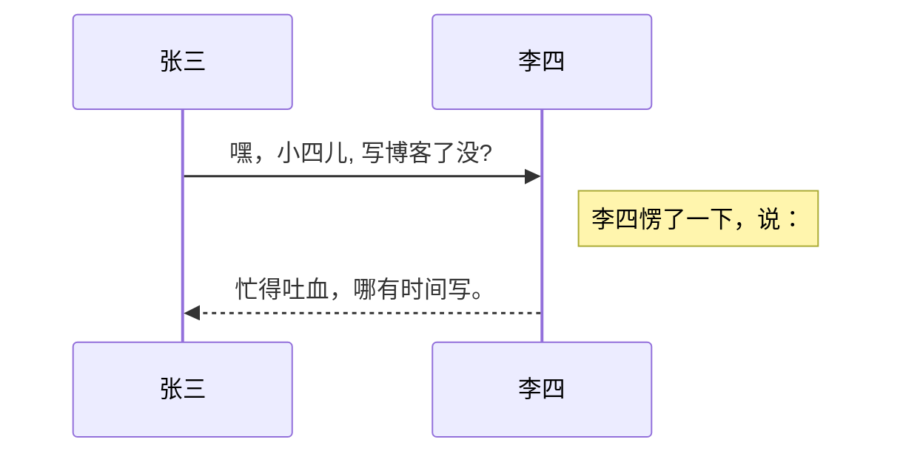

# 测试

```
@RestController
public class Sentinel {
    @SentinelResource(value="Query")
    @RequestMapping(value={"/again"})
    public Map<String,Object> get() {
        Map<String, Object> result = new HashMap<>();
        result.put("code", "success");
        return result;
    }
}
```

# md文件编写学习(对应一级标题)

## 二级标题(以此类推)

### 三级标题(使用==出现分割线)

=== 

### 有序列表

3. 列表1
4. 数字后的点必须是英文点

* 引用示例

 > 此为一级引用内容

>> 此为二级引用内容

***

华丽的分割线，分割线可以由* - _（星号，减号，底线）这3个符号的至少3个符号表示，注意至少要3个，且不需要连续，有空格也可以

* 链接示例

[测试链接](https://blog.csdn.net/qq_36838191/article/details/80579047)

* 参数式链接示例

[home]:https://blog.csdn.net/qq_36838191/article/details/80579047 
[name]:https://blog.csdn.net/qq_36838191/article/details/80579047 
[picture]: https://github.com/Consck/project/raw/master/images/1598854823247.jpg
> 需要将链接地址中blob换成raw即可显示出图片


![picture]

这里是[home],测试[name]链接

### 代码框

#### 第一种 单行用`

`public void dan hang code`

#### 第二种 多行用3个`

```
可以写注释
```


### 表格示例

| 参数 | 作用 | 附加 |
|:--------|:--------:|--------:|
|`Dcsp.sentinel`|向 Sentinel 接入端指定控制台的地址|附加|
|左对齐|居中对齐|右对齐|

### 强调

字体加粗

_字体倾斜_

 **字体加粗**

 __字体加粗__

### 删除线
~~删除线~~

<font face="微软雅黑" size=6 color=#FF0000 >微软雅黑字体</font>

<table><tr><td bgcolor=orange> 背景色是 1 orange</td></tr></table>

<table><tr><td bgcolor= BlueViolet > 背景色2 BlueViolet </td></tr></table>

可以渲染序列图：

